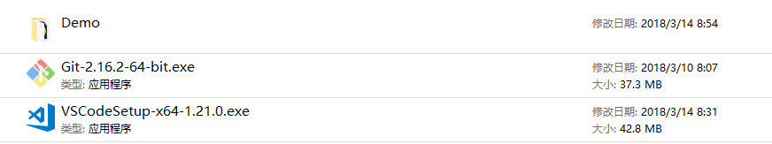
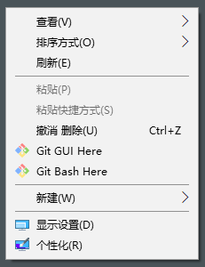
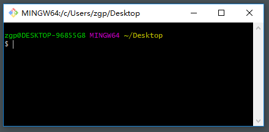
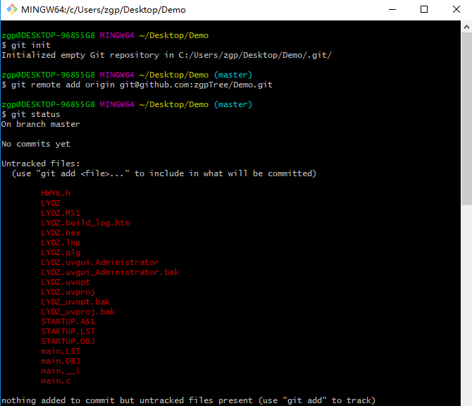
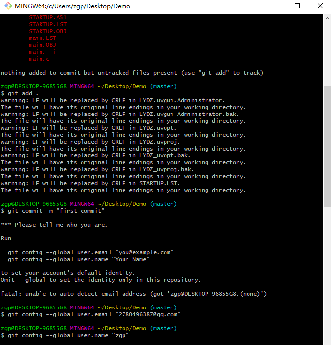
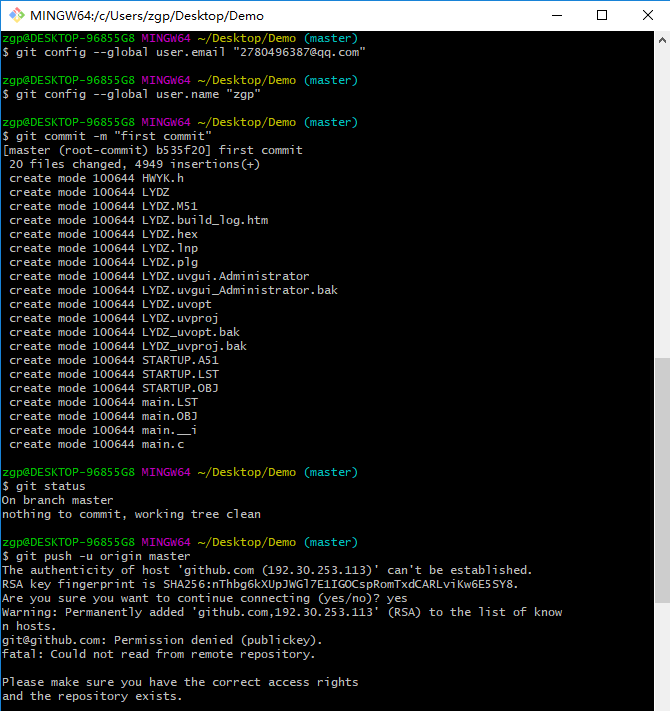

---

- [控制类](#控制类)
- [仪器仪表类](#仪器仪表类)
- [飞行器类](#飞行器类)
- [扩展知识](#扩展知识)
- [201-203项目团队的工作方式](#201-203项目团队的工作方式)
    - [为什么采用这样的工作方式](#为什么采用这样的工作方式)
- [Todo Lists](#todo-lists)

---
# 控制类
- [C51贪吃蛇游戏机](https://github.com/ywg121020/51_sanke_game)`推荐` **林佳涛**
- [StateMachine For C51](https://github.com/zgpTree/c51_state_machine.git)`推荐` **赵国潘**
- [stm32f429](https://github.com/MaJerle/stm32f429)`官方`
    - HC-SR04超声波测量距离(超声波传感器)
    - GPS - Read GPS data
    - ...
- [无刷电机练习]()**`等待添加`**
    - 期望实现正弦运动,并能够设定中心位置的高度
    - 建议使用超声波传感器+测距平台
    - ...
- [风力摆控制系统解析及源码](http://bbs.eeworld.com.cn/forum.php?mod=viewthread&tid=476344&extra=page%3D1&page=1) **网上大佬**
- [帆板控制系统]()**`等待添加`**
- [寻迹程序]()**`等待添加`**
- [stm32 串口驱动集合](https://github.com/zgpTree/stm32_serial_driver.git) **赵国潘**
    - 我通过配置stm32f103每一个串口的驱动了解了很多知识
    - 但是有一些没完成
- [Raspiberry + picamera + opencv Toolbox](https://github.com/IyangDc/py_opencv_tools.git) **赵博文**

# 仪器仪表类
- 

# 飞行器类
- 

# 扩展知识
- [stm32使用C++ cout对象](https://github.com/zgpTree/stm32_cppTest) **赵国潘**
    - 当时想使用C++丰富的语言特性在单片机中编程，但之后意识到C语言的标准库提供了很大一部分实用的函数
    - 当然，如果你感兴趣，请移步[stm32plus](https://github.com/andysworkshop/stm32plus)

# 201-203项目团队的工作方式
## 以`C51 状态机`项目为例说明
1. 在本地计算机建立`C51 状态机`项目的仓库，与github的仓库连接，推送到github端；
1. fork[`刘燕娜的仓库`](https://github.com/mti05001/Electronic-Design-Contest)到本地计算机，加入`C51 状态机`仓库的链接到README.md文件，向刘老师提交修改申请；(若是建设者可以直接修改)
1. 工作方式图解，请参考[详细说明](#详细说明):

## 为什么采用这样的工作方式
- 实验室的软件项目需要优秀的样例程序，这有益于后来人学习；不至于每一届都重复造轮子。
- 支持多人协同开发软件项目，利于培养良好的团队意识，协同开发是软件工作者必须掌握的技能。
- 这培养我们软件开发要考虑维护的工作如何进行，如何更具有可读性，因为你的项目可能由后来人接手，谁都不愿意看到糟糕的程序。
- 这不容易上手，但磨刀不误打柴工。
- :smile:

## 推荐阅读
- [廖雪峰Git教程](https://www.liaoxuefeng.com/wiki/0013739516305929606dd18361248578c67b8067c8c017b000/001373962845513aefd77a99f4145f0a2c7a7ca057e7570000)
- [GitHub Markdown](https://guides.github.com/features/mastering-markdown/)

# Todo Lists
- [x] 完成工作方式说明
- [ ] 定制.gitignore文件，可以参考[stm32f429](https://github.com/MaJerle/stm32f429)。这个文件可以告知git过滤文件(如可执行文件、临时对象文件...)，也就减轻了版本控制系统git的工作的负担！
- [ ] 完成详细说明

---
# 附录
## 详细说明
1. 需要的所有文件如图

    - Demo目录是项目根目录(你可以选择任何一个项目根目录)
    - [Git-*.exe](https://git-scm.com/downloads)是git安装程序
    - [VSCodeSetup-*.exe](https://git-scm.com/downloads)是Visual Studio Code，微软开源的编辑器，它支持插件预览github风格的markdown

1. 本地计算机本地安装[Git](https://git-scm.com/downloads)程序，一直点击next默认安装即可，安装完成后鼠标右击菜单如图
    

1. 注册[GitHub](https://github.com/)帐号，并新建一个仓库（下文称其为仓库X），github新建仓库如图
    

    

    实际上，github是非常友好的，它提示了Quick setup:
    

1. 打开`Git Bash`
    

    改变工作目录到项目根目录
    

    

    

    

    

1. 安装VSCode(暂时未能解决windows环境vscode图片不能预览的问题--已解决，已知bug)
